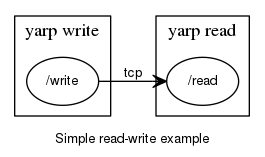

In this step you will learn something else

On terminal #1: `yarp server`{{execute T1}}

On terminal #2: `yarp read /read`{{execute T2}}

On terminal #3: `yarp write /write /read`{{execute T3}}


We'll say a bit more about "yarp server" in the next section;
for now it is enough to know that it acts as a database for port contact
information.
We can ignore it for now.

If you type a list of numbers on terminal #3 (`yarp write`), they will show up
on terminal 2 (`yarp read`), e.g. if you type on terminal 3:

`10 -5 17.15 6`{{execute T3}}

you will see the same on terminal #2:

```
10 -5 17.15 6
```

Our network so far is very simple:


